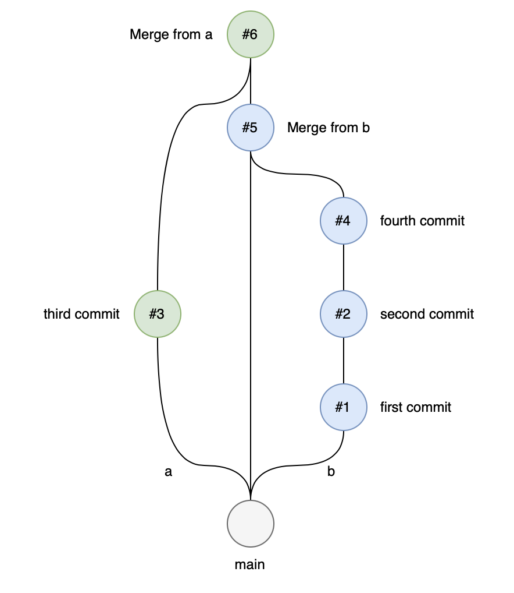
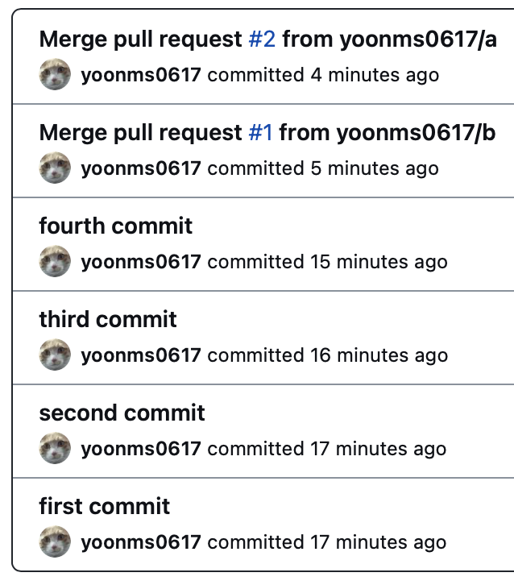
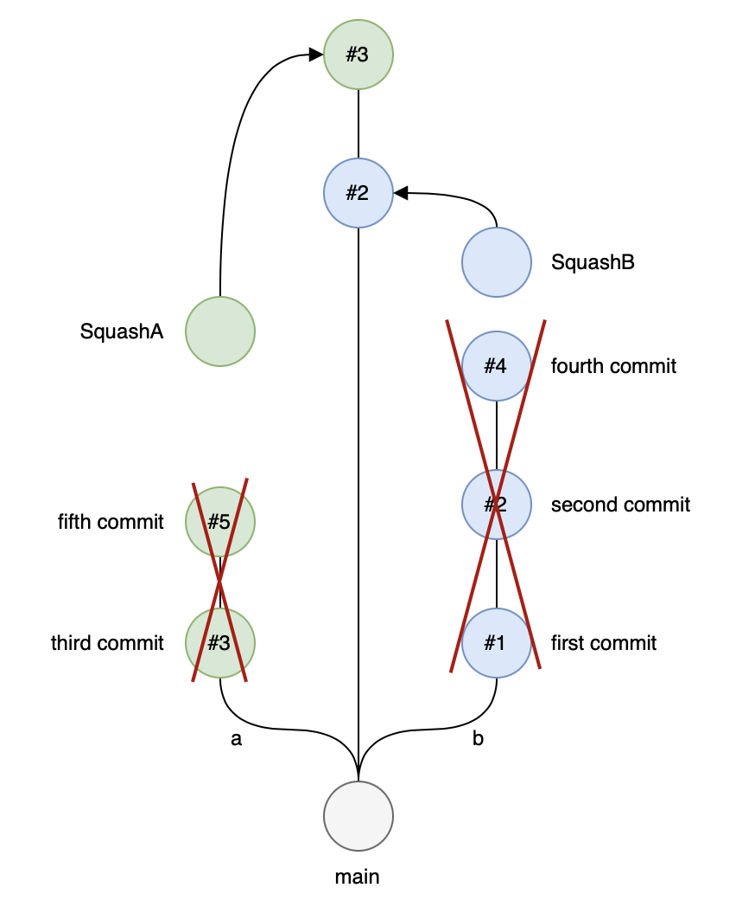
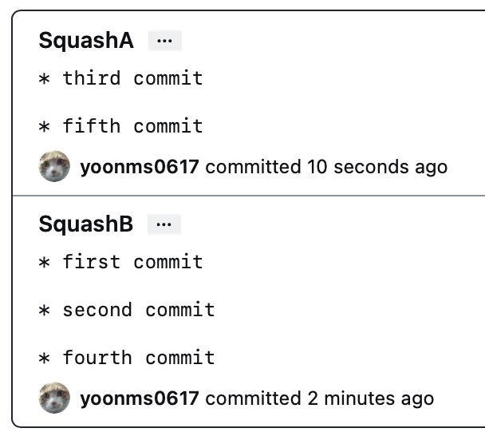
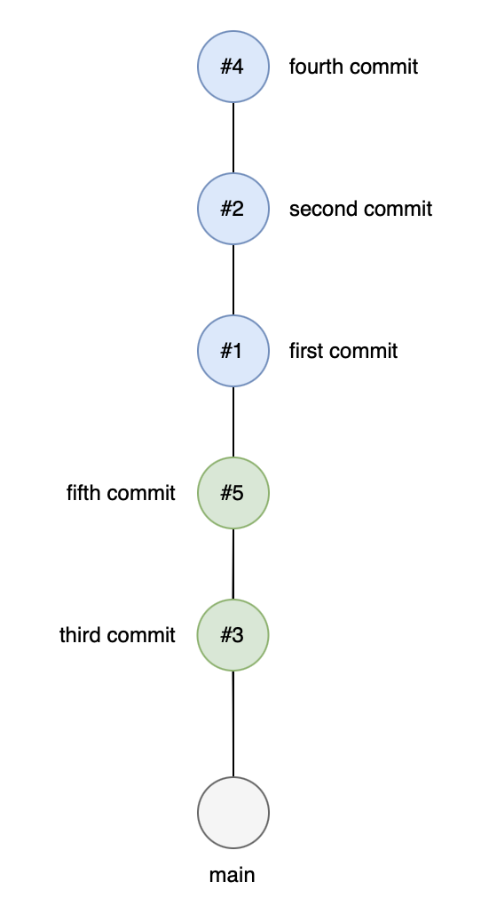
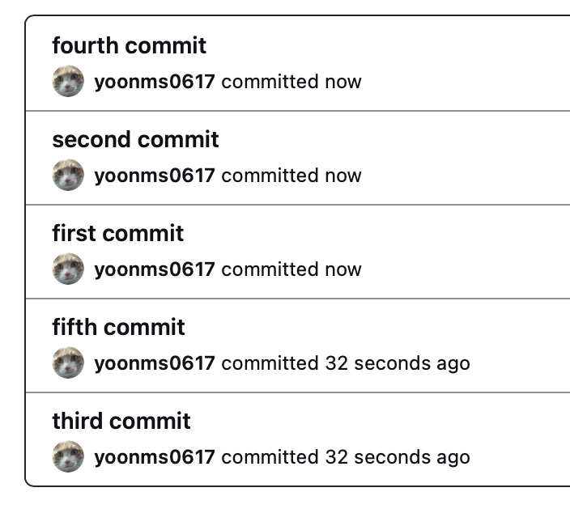

Git은 특정 브랜치에서 작업한 내용을 다른 브랜치에 병합(Merge)할 수 있는 다양한 방법을 제공한다.

브랜치를 병합하는 다양한 방법이 있지만 주로 아래 세 가지 방법이 많이 사용된다.

- **Merge**
- **Squash and Merge**
- **Rebase and Merge**

GitHub도 위의 세 가지 방법을 지원하며 어떤 방식을 사용하는지에 따라 커밋 히스토리가 기록되는 방식이 달라진다.

{: .align-center width="350"}

## 🎯 Create a merge commit

  
  

기본적인 병합 방법으로 커밋 히스토리를 모두 남긴다.

커밋 히스토리가 전부 남겨져 있기 때문에 병합된 브랜치가 삭제되어도 어떤 커밋을 진행했는지 자세한 정보를 얻을 수 있다.

하지만 작업중인 브랜치 개수가 많거나 병합이 잦으면 커밋 히스토리의 가독성이 떨어진다는 점도 있다.

## 🎯 Squash and Merge

  
  

<!-- <figure class="align-center">
  
  
</figure> -->

여러 개의 커밋을 하나의 커밋으로 합쳐 병합하는 방식으로 진행한다.

커밋 히스토리를 깔끔하게 가져갈 수 있지만 일반적인 병합 방법보다는 정보를 많이 얻을 수 없다.

## 🎯 Rebase and Merge

<figure class="align-center">
  
  
</figure>

Rebase는 단어 그대로 베이스를 다시 설정하는 작업으이다. 일반적인 병합 방법과 실행 결과는 같지만 커밋 히스토리는 달라진다.

일반적인 병합 방법은 병합했다는 커밋 히스토리가 남지만 Rebase를 사용한 경우는 병합했다는 커밋 히스토리가 남지 않는다.

마치 하나의 브랜치에서 작업한 것처럼 커밋 히스토리를 깔끔하게 가져갈 수 있지만 Rebase 사용에 익숙하지 않은 경우 문제 발생시 대처가 어려운 점이 있다.

---

#### 📌 참고

- [GitHub의 Merge, Squash and Merge, Rebase and Merge 정확히 이해하기](https://meetup.toast.com/posts/122)
- [커밋 히스토리를 이쁘게 단장하자](https://evan-moon.github.io/2019/08/30/commit-history-merge-strategy/)
- [Git의 다양한 머지 전략 비교 - 우리 팀은 어떤 전략을 도입해야 할까?](https://inmoonlight.github.io/2021/07/11/Git-merge-strategy/)